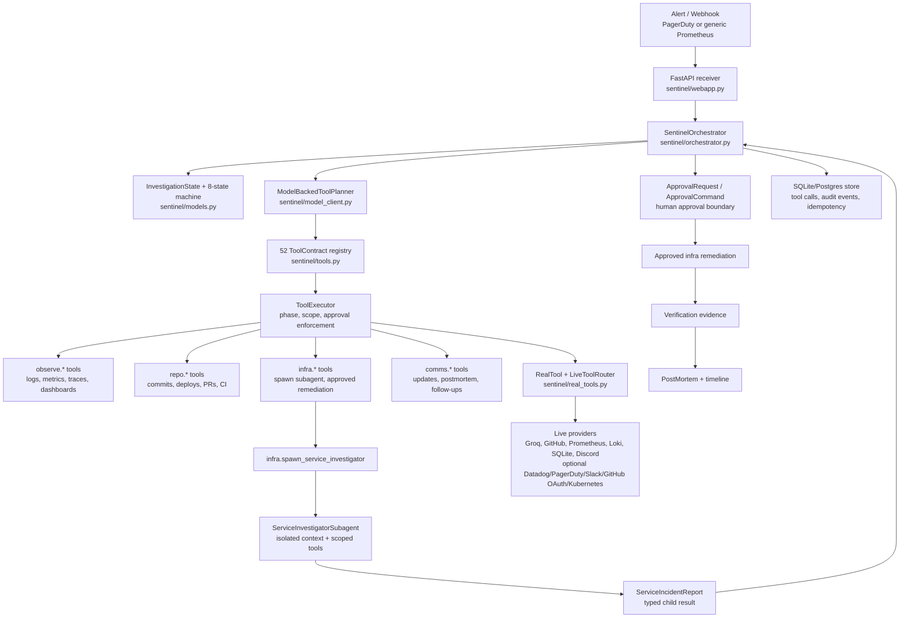

# SENTINEL Architecture

SENTINEL is a self-hosted incident-response agent. It attaches an Investigation to an incoming alert, gathers evidence across operational systems, spawns scoped subagents when the incident needs service-local investigation, asks for human approval before mutation, executes only the approved action, verifies recovery, and writes the incident timeline.

This file is meant for reviewers. It points to the exact files that prove the architecture is real.

## High-Level Diagram

## Reviewer File Map

| What to verify | Open this | What to look for |
|---|---|---|
| Product idea | [README.md](README.md), [PRD.md](PRD.md) | Incident-response agent for early on-call investigation, approval, remediation, and timeline generation. |
| 8-state incident flow | [sentinel/models.py](sentinel/models.py) | `StateName`, `STATE_MACHINE`, `InvestigationState`, `PlanStep`, `ToolCallRecord`. |
| Parent orchestrator | [sentinel/orchestrator.py](sentinel/orchestrator.py) | `SentinelOrchestrator`, `_run_incident`, `_plan`, `_tool_step`, `_invoke_tool`, `_spawn_service_investigator`. |
| 52 tools across 4 namespaces | [sentinel/tools.py](sentinel/tools.py) | `OBSERVE_TOOLS`, `REPO_TOOLS`, `INFRA_TOOLS`, `COMMS_TOOLS`, `build_tool_contracts`. |
| Registry coherence | [sentinel/tools.py](sentinel/tools.py), [tests/test_tools.py](tests/test_tools.py) | `ToolContract`, `ToolRegistry`, `ToolFactory`; test asserts exactly 52 tools across observe/repo/infra/comms. |
| Model-driven tool choice | [sentinel/model_client.py](sentinel/model_client.py), [docs/model-driven-proof.md](docs/model-driven-proof.md), [tests/test_model_client.py](tests/test_model_client.py) | `ModelBackedToolPlanner.plan_tools` sends all tool schemas and eligible tools to a hosted model, then accepts only eligible returned names. |
| Phase and scope enforcement | [sentinel/tools.py](sentinel/tools.py) | `ToolExecutor.invoke` rejects unregistered tools, tools outside subagent scope, tools outside the current phase, and unapproved remediation. |
| Real subagent boundary | [sentinel/subagents.py](sentinel/subagents.py), [docs/subagent-proof.md](docs/subagent-proof.md) | `IsolatedSubagentContext`, `ServiceInvestigatorSubagent`, `SubagentLauncher`, `ServiceInvestigatorSpawnTool`. |
| Subagent as a registered tool | [sentinel/tools.py](sentinel/tools.py), [sentinel/subagents.py](sentinel/subagents.py) | `infra.spawn_service_investigator` is in `INFRA_TOOLS`, has a `ToolContract`, and is bound to `ServiceInvestigatorSpawnTool`. |
| Structured child result | [sentinel/models.py](sentinel/models.py), [sentinel/subagents.py](sentinel/subagents.py) | `ServiceIncidentReport` includes `isolated_context_id`, `scoped_tool_names`, diagnosis, evidence, and suggested fix. |
| Composable outputs | [sentinel/orchestrator.py](sentinel/orchestrator.py), [tests/test_orchestrator.py](tests/test_orchestrator.py) | Parent consumes `ServiceIncidentReport` outputs in `_reconcile_evidence`; test mutates a child report and verifies parent confidence changes. |
| Long-horizon run | [scripts/run_sentinel_demo.py](scripts/run_sentinel_demo.py), [docs/subagent-proof.md](docs/subagent-proof.md) | Demo produces 37 tool calls and 26 plan steps in one completed investigation. |
| Human approval boundary | [sentinel/orchestrator.py](sentinel/orchestrator.py), [sentinel/models.py](sentinel/models.py) | `ApprovalRequest`, `ApprovalCommand`, `_approval_command_rejection_reason`, `_continue_after_approval`. |
| Live adapters | [sentinel/real_tools.py](sentinel/real_tools.py), [sentinel/live_clients.py](sentinel/live_clients.py) | `RealTool`, `LiveToolFactory`, `LiveToolRouter`, provider clients, retry/error normalization, handler coverage. |
| Live proof | [docs/live-proof.md](docs/live-proof.md), [docs/real-slow-query-summary.json](docs/real-slow-query-summary.json) | 34 recorded live tool calls, Groq model plans, GitHub evidence, checkpoint recovery, Prometheus alert/evidence, Loki slow-query log, SQLite index creation, Discord timeline, latency improvement from 115.2ms to 1.2ms. |
| Deployment shape | [docker-compose.yml](docker-compose.yml), [Dockerfile](Dockerfile), [sentinel/webapp.py](sentinel/webapp.py) | FastAPI receiver, Postgres, Redis, Prometheus, Loki, readiness and metrics endpoints. |
| Evaluation harness | [sentinel/evaluation.py](sentinel/evaluation.py), [tests/test_evaluation.py](tests/test_evaluation.py) | Scenario oracles for golden path, degraded-tool behavior, and Watch safety. |
| Production tests | [tests/test_production_wiring.py](tests/test_production_wiring.py), [tests/test_production_security.py](tests/test_production_security.py), [tests/test_live_artifacts.py](tests/test_live_artifacts.py) | Webhook/OAuth/security, pagination, malformed provider payloads, live evidence validation, and mutation scope. |
| Assignment memo | [MEMO.md](MEMO.md) | What was built, what was cut, more time, and one design decision defended. |
| Trace submission boundary | [README.md](README.md), [codex-traces-redacted.jsonl](codex-traces-redacted.jsonl) | Public redacted trace is for review convenience only; native unedited Codex trace is submitted separately by email. |

## Request Flow

1. A webhook arrives through [sentinel/webapp.py](sentinel/webapp.py).
2. The receiver creates or resumes an `InvestigationState` from [sentinel/models.py](sentinel/models.py).
3. [sentinel/orchestrator.py](sentinel/orchestrator.py) moves the Investigation through the canonical states.
4. For each phase, `_plan` calls [sentinel/model_client.py](sentinel/model_client.py) with all tool schemas and only phase-eligible tools.
5. [sentinel/tools.py](sentinel/tools.py) executes selected tools through `ToolExecutor.invoke`, recording tool calls, hashes, reasoning traces, success/error state, and audit events.
6. When service-local investigation is justified, `infra.spawn_service_investigator` creates an isolated subagent in [sentinel/subagents.py](sentinel/subagents.py).
7. The subagent uses only scoped observe/repo tools and returns a typed `ServiceIncidentReport`.
8. The parent reconciles service reports, blast radius, and remediation readiness into a diagnosis.
9. If remediation is needed, the parent creates an `ApprovalRequest` and refuses mutation until a matching `ApprovalCommand` arrives.
10. Approved remediation runs through infra tools, then SENTINEL verifies recovery and drafts the postmortem.

## Assignment Requirement Map

| `Problem.md` requirement | Proof in this repo |
|---|---|
| 50+ tools across at least 4 namespaces | [sentinel/tools.py](sentinel/tools.py) declares 52 tools across `observe`, `repo`, `infra`, and `comms`; [tests/test_tools.py](tests/test_tools.py) asserts the exact counts. |
| Model-driven tool selection | [sentinel/model_client.py](sentinel/model_client.py) sends the tool schemas and eligible names to a model; [docs/model-driven-proof.md](docs/model-driven-proof.md) records a hosted model selection; [tests/test_model_client.py](tests/test_model_client.py) verifies state-dependent selection. |
| Real subagent orchestration | [sentinel/tools.py](sentinel/tools.py) registers `infra.spawn_service_investigator`; [sentinel/subagents.py](sentinel/subagents.py) creates isolated contexts and scoped tool sets; [docs/subagent-proof.md](docs/subagent-proof.md) shows denied infra/comms access inside the child. |
| 20+ tool-call long-horizon execution | [scripts/record_credentialed_live_e2e.sh](scripts/record_credentialed_live_e2e.sh) and [docs/live-proof.md](docs/live-proof.md) show a 34-call real credentialed live run; [scripts/run_sentinel_demo.py](scripts/run_sentinel_demo.py) and [docs/subagent-proof.md](docs/subagent-proof.md) also show a 37-call, 26-step deterministic run. |
| Production scaffolding | [sentinel/real_tools.py](sentinel/real_tools.py), [sentinel/live_clients.py](sentinel/live_clients.py), [sentinel/webapp.py](sentinel/webapp.py), [docker-compose.yml](docker-compose.yml), and the `tests/` suite cover retries, rate limits, typed errors, audit records, live adapters, deployment shape, and unit/integration paths. |
| Composable tool inputs/outputs | `ServiceIncidentReport` from [sentinel/subagents.py](sentinel/subagents.py) is consumed by the parent in [sentinel/orchestrator.py](sentinel/orchestrator.py); [tests/test_orchestrator.py](tests/test_orchestrator.py) proves the child report affects parent diagnosis confidence. |
| One-page memo | [MEMO.md](MEMO.md). |
| Native unedited traces | The public repo has [codex-traces-redacted.jsonl](codex-traces-redacted.jsonl) for convenience; the native unedited Codex JSONL is submitted separately as the email attachment. |
